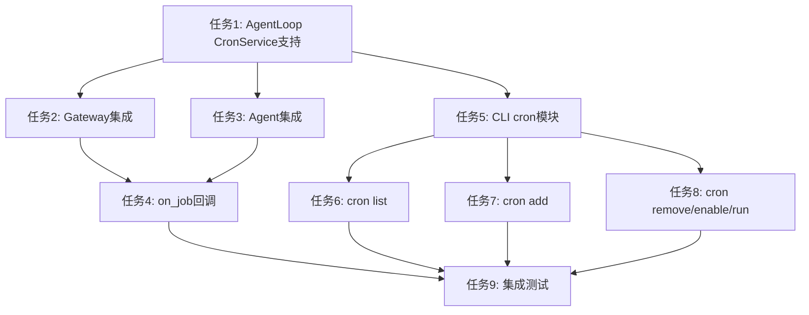

# 实施计划

## 任务概述

将 CronTool 集成到 AgentLoop 和 CLI 系统，实现通过 AI 助手对话和 CLI 命令两种方式管理定时任务。

---

- [ ] 1. 修改 AgentLoop 支持 CronService 参数
   - 为 AgentLoop 结构体添加 `cron_service: Option<Arc<CronService>>` 字段
   - 修改 `new()` 和 `new_direct()` 方法，添加可选的 `cron_service` 参数
   - 在初始化 ToolRegistry 后，如果提供了 cron_service，则注册 CronTool
   - 调用 `provider.bind_tools()` 更新工具列表
   - _需求：1.1、1.2、1.4_

- [ ] 2. 在 Gateway 命令中集成 CronService
   - 在 `GatewayCmd::run()` 中创建 CronService 实例，指定持久化存储路径
   - 设置 CronService 的 `on_job` 回调，通过 AgentLoop 执行任务消息
   - 在服务启动时调用 `cron.start()`
   - 在服务停止时调用 `cron.stop()`
   - 将 CronService 传递给 AgentLoop 构造函数
   - _需求：2.1、2.2、2.5、2.6_

- [ ] 3. 在 Agent 命令中集成 CronService
   - 在 `AgentCmd::run()` 中创建 CronService 实例
   - 使用默认数据目录路径作为持久化存储路径
   - 将 CronService 传递给 AgentLoop 构造函数
   - _需求：4.1、4.2、4.4_

- [ ] 4. 实现 on_job 回调机制
   - 在 CronService 初始化时设置 `on_job` 回调函数
   - 回调函数通过 `AgentLoop.process_direct()` 执行任务消息
   - 从 CronPayload 中提取 channel 和 chat_id 构建会话键
   - 实现错误处理，确保任务执行异常不中断调度器
   - _需求：5.1、5.4、6.4_

- [ ] 5. 添加 Cron CLI 子命令模块
   - 创建 `crates/cli/src/commands/cron/mod.rs`
   - 定义 `CronCmd` 结构体，支持 list、add、remove、enable、run 子命令
   - 在 `crates/cli/src/commands/mod.rs` 中导出 CronCmd
   - 在 `crates/cli/src/main.rs` 中添加 cron 子命令到 CLI 枚举
   - _需求：3.1_

- [ ] 6. 实现 `cron list` 命令
   - 从配置文件获取数据目录路径
   - 创建 CronService 实例并加载任务
   - 以表格形式显示任务 ID、名称、调度规则、状态、下次执行时间
   - 支持 `--all` 参数包含已禁用的任务
   - _需求：3.1、3.2_

- [ ] 7. 实现 `cron add` 命令
   - 支持 `--every`（间隔秒数）、`--cron`（cron 表达式）、`--at`（指定时间）三种调度方式
   - 支持 `--tz` 参数指定时区（仅与 --cron 配合使用）
   - 支持 `--name` 和 `--message` 参数
   - 验证参数有效性，返回明确的错误提示
   - _需求：3.3、3.4_

- [ ] 8. 实现 `cron remove`、`cron enable`、`cron run` 命令
   - `remove <job_id>`：删除指定任务并显示成功消息
   - `enable <job_id>`：启用指定任务，支持 `--disable` 参数禁用任务
   - `run <job_id>`：立即执行指定任务并显示执行结果，支持 `--force` 参数强制执行已禁用任务
   - _需求：3.5、3.6、3.7、3.8、3.9_

- [ ] 9. 编写集成测试
   - 测试 AgentLoop 注册 CronTool 后的工具调用流程
   - 测试 CronService 的任务持久化和恢复
   - 测试 CLI 命令的各项功能
   - 测试任务执行和消息投递流程
   - _需求：成功标准 1_

---

## 依赖关系

## 关键技术点

1. **ToolContext 运行时传递**：工具执行时通过 `execute(&ctx, params)` 动态传入 channel 和 chat_id，无需在工具注册时设置状态

2. **CronPayload 持久化上下文**：任务创建时将 channel 和 chat_id 保存到 payload 中，执行时从 payload 恢复上下文

3. **优雅关闭**：Gateway 停止时需调用 `cron.stop()` 确保任务数据持久化

4. **错误隔离**：单个任务执行失败不应影响调度器和其他任务的运行
