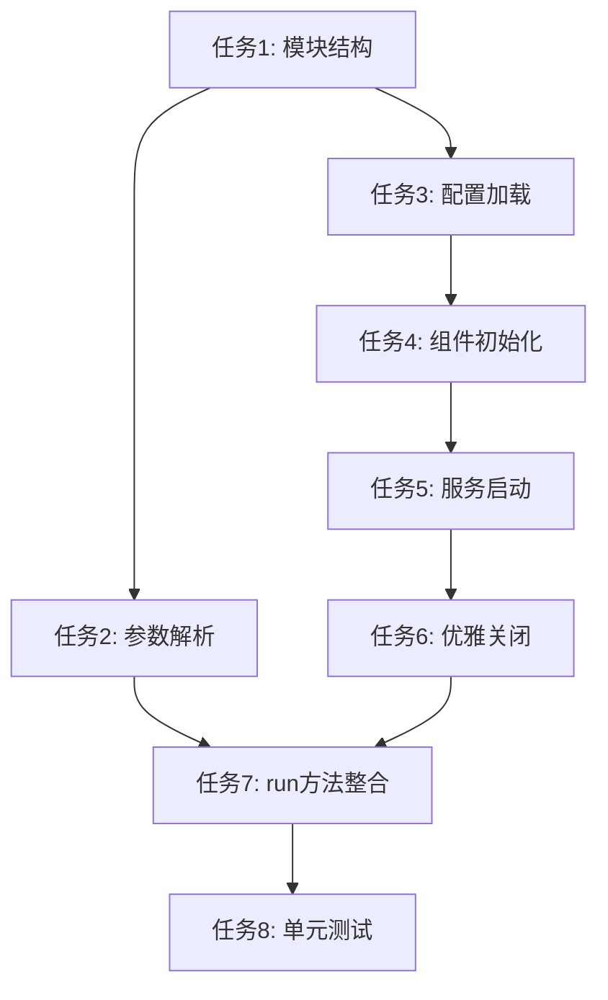

# 任务清单

## 概述

实现 Rust 版 gateway 命令，用于启动 nanobot 后台服务。该命令初始化并协调 AgentLoop 和 ChannelManager 的并发运行，并提供优雅的启动和关闭机制。

## 任务列表

### 任务 1：创建 gateway 命令模块结构

**状态：** ✅ 已完成

**描述：** 创建 gateway 命令的基础文件结构

**步骤：**
1. 创建 `crates/cli/src/commands/gateway/mod.rs` 文件
2. 创建 `crates/cli/src/commands/gateway/tests.rs` 文件
3. 在 `crates/cli/src/commands/mod.rs` 中添加 gateway 模块导出

**验收标准：**
- [x] 文件结构正确创建
- [x] 模块正确导出
- [x] 编译无错误

---

### 任务 2：实现命令行参数解析

**状态：** ✅ 已完成

**描述：** 实现 GatewayCmd 结构体，解析命令行参数

**步骤：**
1. 定义 `GatewayCmd` 结构体，使用 clap 的 `Args` 派生宏
2. 添加 `--port/-p` 参数（默认值 18790）
3. 添加 `--verbose/-v` 参数

**代码参考：**
```rust
#[derive(Args, Debug)]
pub struct GatewayCmd {
    /// 服务端口（默认 18790）
    #[arg(short, long, default_value = "18790")]
    pub port: u16,
    
    /// 启用详细日志
    #[arg(short, long)]
    pub verbose: bool,
}
```

**验收标准：**
- [x] 参数定义正确
- [x] 默认值设置正确
- [x] 帮助信息清晰

---

### 任务 3：实现配置加载与验证

**状态：** ✅ 已完成

**描述：** 实现配置文件加载和必要的验证逻辑

**步骤：**
1. 加载 Config 配置文件
2. 验证 API Key 是否存在
3. 配置不存在时输出错误提示
4. 初始化日志（支持 verbose 模式）

**代码参考：**
```rust
// 加载配置
let config = Config::load()
    .map_err(|e| anyhow::anyhow!("加载配置失败: {}。请先运行 'nanobot onboard' 进行配置。", e))?;

// 验证 API Key
if config.provider().api_key.is_empty() {
    return Err(anyhow::anyhow!("API Key 未配置。请在 ~/.nanobot/config.json 中设置 api_key。"));
}
```

**验收标准：**
- [x] 配置正确加载
- [x] API Key 验证正确
- [x] 错误提示友好

---

### 任务 4：实现核心组件初始化

**状态：** ✅ 已完成

**描述：** 按照 Python 版逻辑顺序初始化所有核心组件

**步骤：**
1. 初始化 LLM Provider（OpenAILike）
2. 创建消息通道（inbound/outbound）
3. 创建 AgentLoop 实例
4. 创建 ChannelManager 实例

**代码参考：**
```rust
// 初始化 LLM Provider
let provider = OpenAILike::from_config(&config)?;

// 创建消息通道
let (inbound_tx, inbound_rx) = mpsc::channel::<InboundMessage>(100);
let (outbound_tx, outbound_rx) = mpsc::channel::<OutboundMessage>(100);

// 创建 AgentLoop
let agent_loop = AgentLoop::new(provider, config.agents.defaults.clone(), inbound_rx, outbound_tx);

// 创建 ChannelManager
let channel_manager = ChannelManager::new(
    config.channels.clone(),
    outbound_rx,
    inbound_tx,
).await?;
```

**验收标准：**
- [x] 组件初始化顺序正确
- [x] 消息通道正确连接
- [x] 所有组件创建成功

---

### 任务 5：实现并发服务启动

**状态：** ✅ 已完成

**描述：** 并发启动 AgentLoop 和 ChannelManager

**步骤：**
1. 显示启动信息和 logo
2. 在独立的 tokio 任务中启动 AgentLoop
3. 启动 ChannelManager（start_all）
4. 显示已启用的通道列表
5. 等待所有服务运行

**代码参考：**
```rust
// 显示启动信息
print_logo();
println!("启动 nanobot gateway...");

// 启动 AgentLoop 后台任务
let agent_task = tokio::spawn(async move {
    if let Err(e) = agent_loop.run().await {
        error!("AgentLoop 运行失败: {}", e);
    }
});

// 启动通道管理器
channel_manager.start_all().await?;

// 显示通道列表
let status = channel_manager.get_status().await;
println!("已启用的通道: {:?}", status.iter().map(|s| &s.name).collect::<Vec<_>>());

// 等待信号
tokio::signal::ctrl_c().await?;
```

**验收标准：**
- [x] AgentLoop 正确启动
- [x] ChannelManager 正确启动
- [x] 启动信息清晰显示

---

### 任务 6：实现优雅关闭机制

**状态：** ✅ 已完成

**描述：** 实现 Ctrl+C 信号捕获和优雅关闭流程

**步骤：**
1. 捕获 Ctrl+C 信号
2. 按顺序停止服务：AgentLoop -> ChannelManager
3. 显示关闭进度
4. 确保资源正确释放

**代码参考：**
```rust
// 捕获中断信号
tokio::signal::ctrl_c().await?;
info!("收到中断信号，开始优雅关闭...");

// 停止服务
println!("正在停止服务...");
agent_task.abort();  // 停止 AgentLoop
channel_manager.stop_all().await?;  // 停止 ChannelManager

println!("服务已停止");
```

**验收标准：**
- [x] 信号正确捕获
- [x] 服务按序停止
- [x] 资源正确释放
- [x] 关闭信息清晰

---

### 任务 7：实现 run 方法整合

**状态：** ✅ 已完成

**描述：** 实现 GatewayCmd 的 run 方法，整合所有功能

**步骤：**
1. 整合参数解析
2. 整合配置加载
3. 整合组件初始化
4. 整合服务启动
5. 整合优雅关闭

**验收标准：**
- [x] 逻辑流程正确
- [x] 错误处理完善
- [x] 代码结构清晰

---

### 任务 8：编写单元测试

**状态：** ✅ 已完成

**描述：** 为 gateway 命令编写单元测试

**步骤：**
1. 测试参数解析
2. 测试配置验证逻辑
3. 测试错误处理

**验收标准：**
- [x] 测试覆盖核心逻辑
- [x] 所有测试通过

---

## 依赖关系



## 关键文件

| 文件路径 | 说明 |
|---------|------|
| `crates/cli/src/commands/gateway/mod.rs` | gateway 命令主实现 |
| `crates/cli/src/commands/gateway/tests.rs` | 单元测试 |
| `crates/cli/src/commands/mod.rs` | 命令模块导出 |
