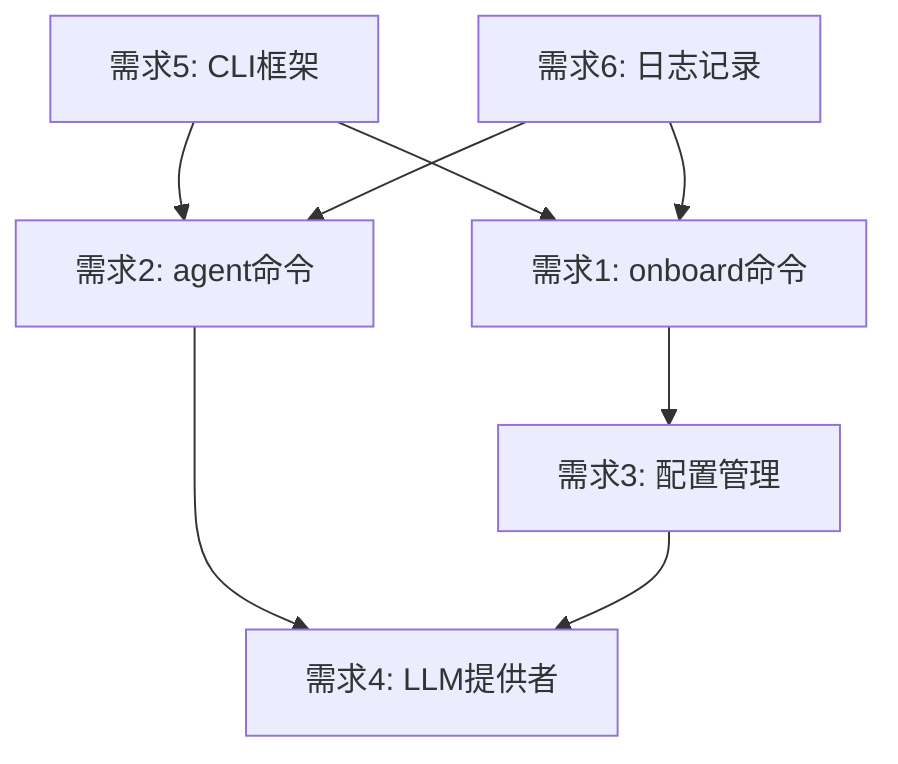

# 需求文档：模块 1 - 基础对话能力（对齐 HKUDS/nanobot）

## 引言

本模块是 nanobot-rs 项目的核心基础模块，极简复现 HKUDS/nanobot 的 `onboard` 和 `agent` 两个命令的核心功能。

### 功能对齐说明

本需求文档严格对齐 HKUDS/nanobot 的以下核心功能：
- **onboard 命令**：配置 LLM 提供者，生成配置文件
- **agent 命令**：启动 AI Agent 进行交互式对话

### 技术背景

- 项目使用 Rust 语言开发
- 对接 OpenAI 及兼容 OpenAI API 的服务商
- 支持异步并发处理
- 配置文件使用 JSON 格式

---

## 需求

### 需求 1：onboard 命令 - LLM 提供者配置

**用户故事：** 作为用户，我希望通过 onboard 命令配置 LLM 提供者，以便系统能够连接 AI 服务。

#### 验收标准

1. WHEN 用户执行 `nanobot onboard` 时 THEN 系统 SHALL 启动交互式配置向导
2. WHEN 配置向导启动时 THEN 系统 SHALL 提示用户输入 API Base URL（默认为 OpenAI 官方地址）
3. WHEN 用户输入 API Base URL 时 THEN 系统 SHALL 提示输入 API Key 和模型名称
4. WHEN 配置完成后 THEN 系统 SHALL 生成 `~/.nanobot/config.json` 配置文件
5. IF 配置文件已存在 THEN 系统 SHALL 提示用户是否覆盖

---

### 需求 2：agent 命令 - AI Agent 交互

**用户故事：** 作为用户，我希望通过 agent 命令启动 AI Agent，以便进行交互式对话。

#### 验收标准

1. WHEN 用户执行 `nanobot agent` 时 THEN 系统 SHALL 启动交互式对话会话
2. WHEN Agent 启动时 THEN 系统 SHALL 加载配置文件中的 LLM 提供者配置
3. WHEN 用户输入文本消息时 THEN 系统 SHALL 调用 LLM 并返回回复
4. WHEN 用户输入 `exit` 或 `quit` 时 THEN 系统 SHALL 安全退出会话
5. WHEN LLM 调用失败时 THEN 系统 SHALL 显示错误信息并允许用户继续对话
6. WHEN 会话进行时 THEN 系统 SHALL 维护对话历史上下文

---

### 需求 3：配置管理

**用户故事：** 作为系统，我希望统一管理配置文件，以便各组件能够读取配置参数。

#### 验收标准

1. WHEN 系统读取配置时 THEN 系统 SHALL 从 `~/.nanobot/config.json` 加载配置
2. WHEN 配置文件不存在时 THEN 系统 SHALL 提示用户运行 `nanobot onboard` 进行配置
3. WHEN 配置文件格式错误时 THEN 系统 SHALL 返回明确的错误信息
4. WHEN 配置加载成功时 THEN 系统 SHALL 验证必要字段（base_url、api_key、model）

---

### 需求 4：LLM 提供者抽象

**用户故事：** 作为开发者，我希望有统一的 LLM 提供者接口，以便支持 OpenAI 和兼容 OpenAI 的服务商。

#### 验收标准

1. WHEN 系统调用 LLM 时 THEN 系统 SHALL 通过统一的 Provider trait 接口
2. WHEN Provider 初始化时 THEN 系统 SHALL 使用配置的 base_url（默认为 OpenAI 官方地址）
3. WHEN LLM 请求超时时 THEN 系统 SHALL 在 120 秒后返回超时错误
4. WHEN LLM 返回回复时 THEN 系统 SHALL 返回完整的文本内容

---

### 需求 5：CLI 框架

**用户故事：** 作为用户，我希望有清晰的命令行界面，以便方便地使用系统功能。

#### 验收标准

1. WHEN 用户执行 `nanobot --help` 时 THEN 系统 SHALL 显示可用命令列表
2. WHEN 用户执行 `nanobot onboard --help` 时 THEN 系统 SHALL 显示 onboard 命令帮助
3. WHEN 用户执行 `nanobot agent --help` 时 THEN 系统 SHALL 显示 agent 命令帮助
4. WHEN 命令执行出错时 THEN 系统 SHALL 返回非零退出码
5. WHEN 命令执行成功时 THEN 系统 SHALL 返回零退出码

---

### 需求 6：日志记录

**用户故事：** 作为开发者，我希望系统记录运行日志，以便排查问题。

#### 验收标准

1. WHEN 系统运行时 THEN 系统 SHALL 输出结构化日志到 stderr
2. WHEN 发生错误时 THEN 系统 SHALL 记录 ERROR 级别日志
3. WHEN API Key 等敏感信息出现时 THEN 系统 SHALL 脱敏处理
4. IF 设置了 RUST_LOG 环境变量 THEN 系统 SHALL 按指定级别输出日志

---

## 非功能性需求

### 安全要求

1. API Key 不得明文记录到日志
2. 配置文件权限应设置为仅当前用户可读写

### 可维护性要求

1. 代码应有完整的注释和文档
2. 核心模块应有单元测试覆盖

---

## 技术选型（对齐 HKUDS/nanobot）

| 组件 | Rust 方案 | 对应 Python 实现 |
|------|-----------|------------------|
| 异步运行时 | tokio | asyncio |
| CLI 框架 | clap | click |
| HTTP 客户端 | reqwest | httpx |
| 配置解析 | serde + serde_json | pydantic + yaml |
| 日志 | tracing | loguru |
| OpenAI 客户端 | async-openai | litellm |

---

## 依赖关系

---

## 与原项目对应关系

| HKUDS/nanobot 模块 | 本项目对应需求 |
|-------------------|---------------|
| `nanobot/cli/commands.py` - onboard | 需求 1：onboard 命令 |
| `nanobot/cli/commands.py` - agent | 需求 2：agent 命令 |
| `nanobot/config/schema.py` | 需求 3：配置管理 |
| `nanobot/providers/` | 需求 4：LLM 提供者抽象 |
| `nanobot/agent/loop.py` | 需求 2：agent 命令（核心循环） |

---

## 里程碑

- **M1**：完成需求 1、3、5、6（CLI 框架、onboard 命令、配置管理、日志）
- **M2**：完成需求 4（LLM 提供者）
- **M3**：完成需求 2（agent 命令）
- **M4**：集成测试、文档完善
