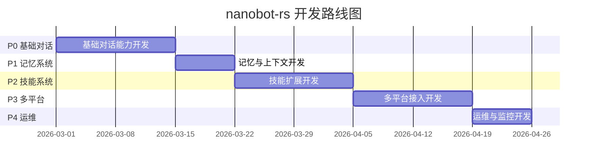

# 需求文档：nanobot

## 项目定位

**nanobot-rs** 是 [HKUDS/nanobot](https://github.com/HKUDS/nanobot) 的 **Rust 语言复现版本**，要求功能**完全兼容**原 Python 版本。

### 什么是 nanobot？

nanobot 是由香港大学数据科学实验室（HKUDS）开源的智能对话机器人框架，具备以下核心能力：

- 🤖 **多模型支持**：接入 OpenAI、Azure、Claude 等多种大语言模型
- 🔌 **多平台接入**：支持 Telegram、Discord、Slack、钉钉、飞书等即时通讯平台
- 🛠️ **工具调用**：AI 可调用外部工具完成任务（如搜索、查询天气、操作数据库）
- 🧠 **智能记忆**：支持多轮对话上下文记忆与长期记忆存储
- 🔄 **多智能体协作**：支持多个 AI Agent 协作完成复杂任务

### 为什么要用 Rust 复现？

| 对比项 | Python 原版 | Rust 复现版 |
|--------|------------|------------|
| 性能 | 一般 | 高性能、低延迟 |
| 内存占用 | 较高 | 低内存占用 |
| 并发能力 | 受 GIL 限制 | 原生异步并发 |
| 部署 | 依赖环境复杂 | 单二进制文件 |
| 类型安全 | 动态类型 | 编译期类型检查 |

## 功能模块概览

本产品共包含 **5 个核心模块**，按优先级排序如下：

| 优先级 | 模块名称 | 模块描述 | 预估工期 |
|--------|----------|----------|----------|
| P0 | 基础对话能力 | 核心对话功能，用户能发消息并收到 AI 回复 | 2 周 |
| P1 | 记忆与上下文 | AI 能记住历史对话，实现连贯的多轮对话 | 1 周 |
| P2 | 技能扩展 | AI 能执行具体任务（如查询天气、创建日程） | 2 周 |
| P3 | 多平台接入 | 支持接入 Telegram、钉钉、飞书等平台 | 2 周 |
| P4 | 运维与监控 | 支持日志查看、性能监控、容器化部署 | 1 周 |

---

## 模块详细说明

### 模块 1：基础对话能力（P0 - 最高优先级）

**业务价值：** 这是产品的核心功能，用户能够向 AI 发送消息并收到智能回复，是后续所有功能的基础。

#### 功能点

1. **消息发送与接收**
   - 用户可以发送文本消息给 AI
   - AI 能够理解消息内容并返回回复
   - 支持基本的问答场景

2. **AI 大模型接入**
   - 支持 OpenAI 等主流 AI 服务
   - 可配置不同的 AI 模型（如 GPT-4、GPT-3.5）

3. **基础会话管理**
   - 每个用户有独立的对话空间
   - 支持开始新对话、继续历史对话

#### 验收标准

- 用户发送消息后，能收到 AI 回复
- 支持 100 个用户同时在线使用
- AI 回复内容与用户问题相关且准确

---

### 模块 2：记忆与上下文（P1）

**业务价值：** AI 能够记住之前的对话内容，实现连贯的多轮对话，提升用户体验。

#### 功能点

1. **对话历史存储**
   - 系统自动保存用户的对话历史
   - 用户可以查看历史对话记录

2. **智能上下文理解**
   - AI 能记住之前提到的信息（如用户姓名、偏好）
   - 支持上下文相关的追问（如"它多少钱？"能理解"它"指代的内容）

3. **记忆管理**
   - 支持清除对话历史
   - 支持设置记忆保留时间

#### 验收标准

- AI 能正确引用 10 轮以内的对话内容
- 用户可查看最近 30 天的对话历史
- 历史数据存储安全，不泄露给其他用户

---

### 模块 3：技能扩展（P2）

**业务价值：** AI 不仅能对话，还能执行具体任务，如查询天气、创建日程、查询数据等，提升实用价值。

#### 功能点

1. **技能框架**
   - 支持添加新技能（类似手机 App 的概念）
   - 技能可以独立开发、测试、部署

2. **内置技能示例**
   - 天气查询：用户问"北京天气"，返回实时天气信息
   - 日程管理：用户说"明天下午 3 点提醒我开会"，系统自动创建提醒

3. **技能管理**
   - 支持启用/禁用特定技能
   - 支持查看技能使用统计

#### 验收标准

- 用户可以通过自然语言触发技能（如"帮我查下天气"）
- 技能执行结果准确率 >= 90%
- 新技能可在 1 天内完成集成

---

### 模块 4：多平台接入（P3）

**业务价值：** 用户可以在常用的即时通讯工具中使用 AI 助手，无需下载新应用，降低使用门槛。

#### 功能点

1. **Telegram 接入**
   - 用户添加 Telegram Bot 后可直接对话
   - 支持 Telegram 特有功能（如 Inline 查询）

2. **钉钉接入**
   - 支持钉钉群聊机器人
   - 支持 @机器人 触发对话

3. **飞书接入**
   - 支持飞书机器人
   - 支持飞书卡片消息

4. **Slack 接入**
   - 支持 Slack App 集成
   - 支持斜杠命令

5. **Discord 接入**
   - 支持 Discord Bot
   - 支持服务器级别配置

#### 验收标准

- 每个平台的接入配置不超过 10 分钟
- 消息能够正常收发
- 支持跨平台统一管理（一个账号多个平台使用）

---

### 模块 5：运维与监控（P4）

**业务价值：** 保障系统稳定运行，便于运维人员发现问题、快速响应，支持标准化部署。

#### 功能点

1. **日志管理**
   - 记录系统运行日志
   - 支持按时间、级别筛选日志
   - 支持日志导出

2. **性能监控**
   - 实时显示在线用户数
   - 显示消息处理速度
   - 显示 AI 响应时间

3. **告警通知**
   - 系统异常时自动通知管理员
   - 支持邮件、短信等多种通知方式

4. **Docker 部署**
   - 提供 Docker 镜像
   - 一键启动服务
   - 支持配置文件管理

#### 验收标准

- 日志保留 30 天
- 系统异常能在 1 分钟内发出告警
- Docker 部署能在 5 分钟内完成

---

## 实施路线图

---

## 风险与应对

| 风险 | 影响 | 应对措施 |
|------|------|----------|
| AI 服务不稳定 | 用户无法获得回复 | 支持多个 AI 服务商，自动切换 |
| 消息平台 API 变更 | 功能不可用 | 关注官方更新，及时适配 |
| 用户量快速增长 | 系统性能下降 | 设计可扩展架构，支持水平扩展 |

---

## 成功指标

- **可用性**：系统正常运行时间 >= 99.9%
- **响应速度**：平均响应时间 < 3 秒
- **用户满意度**：用户好评率 >= 90%
- **并发能力**：支持 1000+ 用户同时在线
